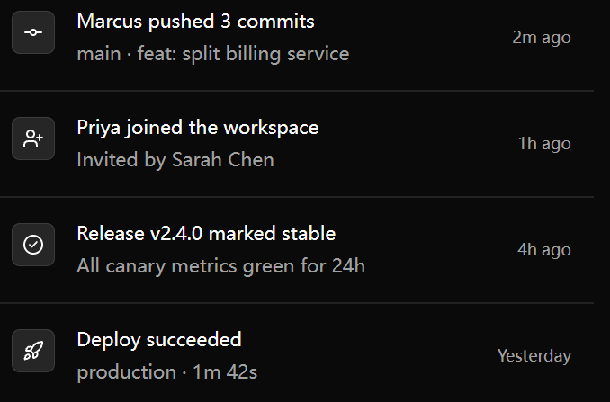

# 白底活动列表设计 Prompt

参考截图中的工作区活动列表布局与信息层级，配色按白色背景适配。下述尺寸按截图估计，可作为界面生成的起点。



## 可直接使用的 Prompt

```text
设计一个简洁的白底工作区活动列表。整体采用纯白背景（#ffffff），事件直接纵向排列在统一背景上，每行之间用 1 px 浅灰横线（约 #e5e7eb）分隔，保持宽松的纵向留白。

每条事件分为三列：左侧是 48 × 48 px 的浅灰图标容器（约 #f5f5f5），圆角约 10 px，配浅灰细边框与深灰线性图标（约 #374151）；中间是上下两行文字，主标题用约 22 px 的近黑色（约 #171717）中等字重，说明用约 21 px 的深灰色（约 #52525b）常规字重，行间距约 8 px；右侧独立展示约 19 px 的灰色相对时间（约 #71717a），右对齐并在事件行内垂直居中。图标与文字之间留约 24 px，图标顶部与标题区域对齐，事件行高约 118 px。

展示四条示例事件：
1. 提交图标；Marcus pushed 3 commits；main · feat: split billing service；2m ago。
2. 添加成员图标；Priya joined the workspace；Invited by Sarah Chen；1h ago。
3. 圆形勾选图标；Release v2.4.0 marked stable；All canary metrics green for 24h；4h ago。
4. 火箭图标；Deploy succeeded；production · 1m 42s；Yesterday。

保持各行图标、标题、说明和时间的对齐一致，视觉重点放在事件标题，辅助信息通过灰色和字号降低强调程度。整体风格平面、克制，以边框、分隔线和留白建立层级。容器变窄时允许说明换行，保留时间的可读性。
```
