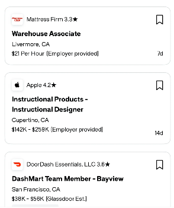

# 侧边列表卡片设计

这份设计参考截图中的职位列表卡片，用于总结窄侧栏里紧凑、易扫描的信息组织方式。核心是白底细边框、圆角和稳定的纵向间距，以粗体标题作为视觉中心，把来源、地点、补充信息和时间放在次级位置。以下区分截图中可见的样式与复用时建议的交互。

## 参考截图

截图展示三张纵向排列的卡片，第三张底部接近截图边界。第二张标题占两行，卡片随内容变高；卡片宽度和间距保持一致。

## 信息层级与布局

| 区域 | 截图内容 | 设计作用 |
| --- | --- | --- |
| 顶部左侧 | 小型品牌图标、公司名称、数字评分和星形符号 | 提供来源，让用户快速识别条目 |
| 顶部右侧 | 线框书签图标 | 留出独立操作位置，图形轻量，不抢标题注意力 |
| 中部 | 加粗职位名称，可自然换行 | 承担主要阅读入口，长标题保持完整含义 |
| 标题下方 | 城市与州 | 提供一行简短上下文 |
| 底部左侧 | 薪资与来源说明，例如 Employer provided 或 Glassdoor Est. | 把数值与其依据放在一起 |
| 底部右侧 | `7d`、`14d` 等简短相对时间 | 便于快速比较条目时间，具体时间字段需由产品定义 |

标题、地点和薪资使用同一左对齐线。顶部的图标和公司信息横向排列，书签靠右；底部的补充信息和时间分居两侧。卡片通过留白和字重区分信息，没有额外的内部横线。

## 视觉样式与尺寸

以下尺寸按截图像素尺度估计，作为复用的起点；字体和浏览器缩放会影响最终尺寸。

| 属性 | 参考值或规则 |
| --- | --- |
| 卡片宽度 | 截图约 280 px；实现时填满侧栏可用宽度 |
| 卡片背景 | 白色，周围为接近白色的浅背景 |
| 边框 | 约 1 px，浅灰色 |
| 圆角 | 约 10–12 px |
| 卡片间距 | 约 12 px |
| 卡片内边距 | 约 12 px |
| 品牌图标 | 约 20 × 20 px，置于小型白色圆角容器，局部有轻微阴影 |
| 主标题 | 约 12–13 px，明显加粗，多行时保持紧凑行距 |
| 公司与正文 | 约 10–11 px，常规字重，深色文字 |
| 相对时间 | 约 9–10 px，底部右对齐 |
| 书签图标 | 约 12 × 16 px，黑色细线轮廓 |
| 卡片阴影 | 截图中不明显，主要由边框分隔 |

整体以黑、白、浅灰为主，品牌图标提供少量色彩。辅助信息主要通过字号和字重降低强调程度，仍保持可读的文字对比度。

## 内容适配

卡片高度由内容决定。截图里的两行标题说明高度应允许增长，标题换行后，地点和底部信息顺序下移，避免与右侧操作重叠。

复用时建议预留右上操作的空间，让来源信息在剩余宽度内布局。底部补充信息可以换行，时间保持完整，空间不足时移到下一行。缺少图标、评分或薪资时省略对应内容，不填入虚构占位数据。

窄侧栏继续保持单列，卡片随容器缩放；长标题和补充说明通过换行消化宽度变化。触控与键盘操作区域可以大于书签图形本身。

## 交互建议

截图只展示静态卡片，无法确认点击、悬停、选中或收藏后的实际行为。复用时建议：

- 点击标题或卡片主体，在主内容区展示该条目的详情。
- 若书签用于收藏，将其设为独立按钮；收藏点击不触发详情打开，并通过图形状态和可访问名称表达结果。
- 悬停时轻微改变边框或背景，选中时增加明确的描边或浅色底，保持卡片尺寸稳定。
- 为键盘焦点提供清晰轮廓，主入口使用链接或按钮，收藏按钮使用可读名称和状态。

实现时用普通单列列表与 CSS 布局即可；卡片内部由纵向内容和两个横向信息行组成，无需额外卡片组件库。

## 在版本时间线中的复用

若将此样式用于 [版本时间线](timeline.md)，建议保留卡片的间距、圆角和信息层级：主标题展示版本名称，副行展示记录类型与时间，小图标表示记录类型。选中版本可沿用现有 `--revision-color` 强调边框。

这一映射属于设计建议，当前时间线仍由 [latex-history.mjs](../plugins/latex-codex/scripts/vendor/latex-history.mjs) 和 [latex-history.css](../plugins/latex-codex/scripts/vendor/latex-history.css) 实现。本文记录参考样式与复用方向，尚未修改界面代码。
