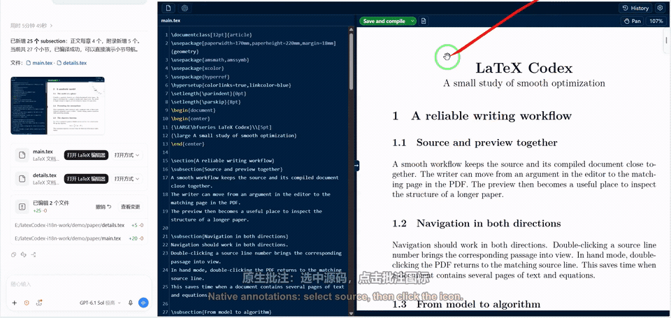
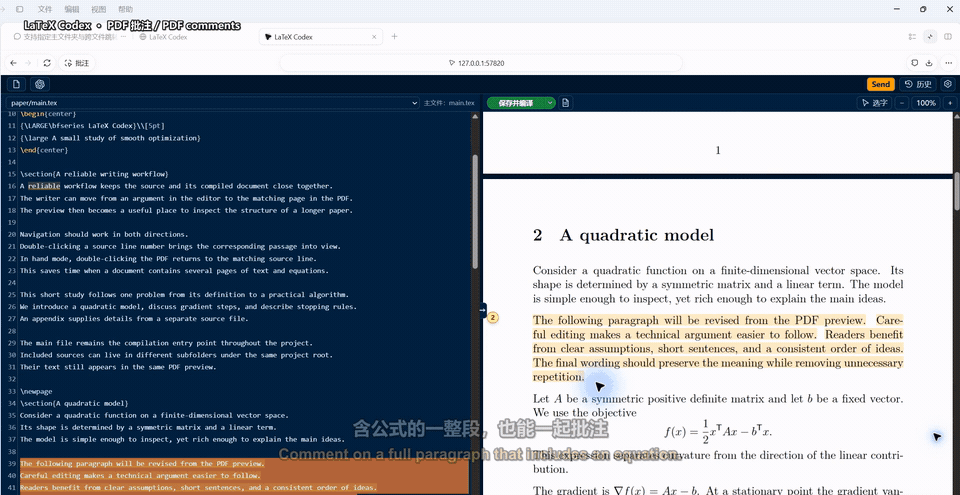
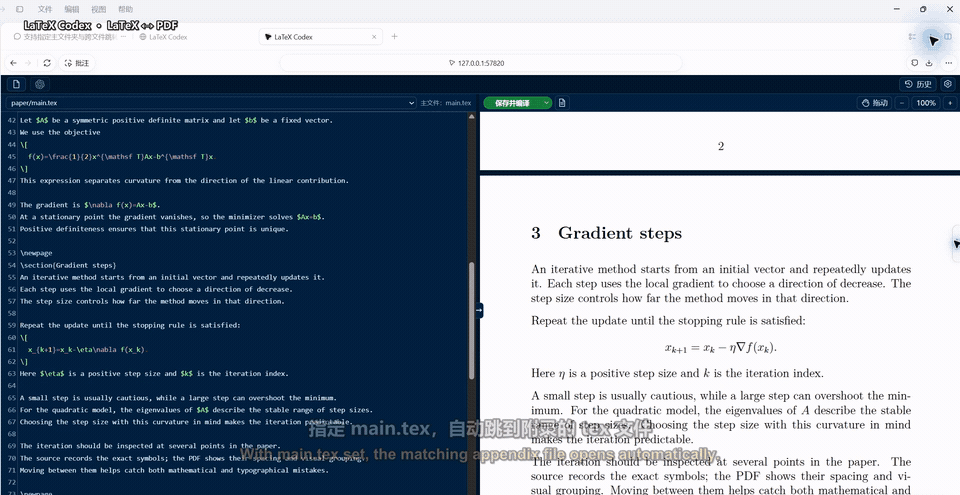
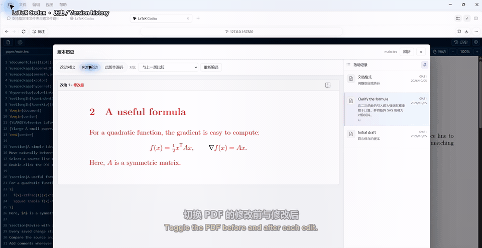
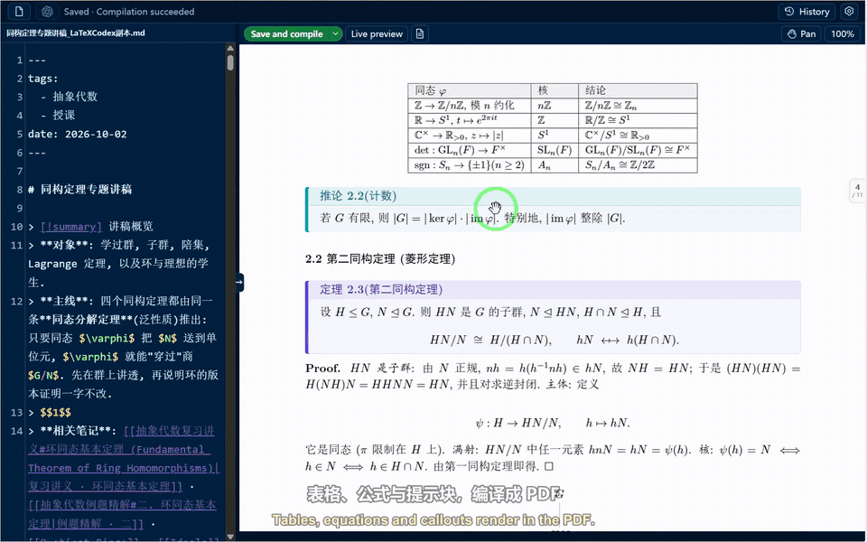

[English](README.md) · [简体中文](README.zh-CN.md)

# LaTeX Codex

在 Codex 侧边栏编辑 LaTeX 和 Markdown，支持本地预览、自动保存和历史。

- 源码与 PDF 双向跳转、PDF 选字与公式框选。
- **Send** 使用已登录的 Codex 生成修改建议，源码与 PDF 逐处 **Keep / Undo**。
- 支持模型与思考等级选择、写作风格和项目对话。
- Markdown 实时预览，以及通过现有 TeX 环境生成 PDF。

对 Codex 说：**使用 latex-codex 打开 main.tex**，或直接运行：

```sh
python plugins/latex-codex/scripts/editor.py /path/to/main.tex
```

在侧边浏览器打开打印的本地地址。选中源码或 PDF 内容，添加批注，然后点击 **Send**。

DeepSeek Harness 由独立的可选插件 **latex-deepseek** 提供；安装或更新 LaTeX Codex 始终保留原生 Codex 后端。两种插件的安装与维护细节见 [AGENTS.md](AGENTS.md)。

## 功能演示

点击预览查看完整演示，均配有中英字幕。

### 批注（主对话框）

选中源码，点击批注图标并保存要求，在 Codex 主对话中统一提交。

[](docs/media/04-native-comments.mp4)

### 临时批注（不占主对话框）

在 PDF 顶部切换**选字 / 拖动**。选字模式下，按住**空格**拖动页面，按住 **空格 + Alt** 并上下拖动鼠标可缩放。可框选，也可直接拖选文字；右键添加批注，或在设置中开启框选后自动弹出批注。

在源码和临时红绿 PDF 中逐处审阅建议：**Keep** 保存该处修改，**Undo** 保留原文。可在**齿轮**中分别开关编辑器与 PDF 校对；开启**项目修改校对**后，还可审阅主对话或外部工具对项目 TeX 文件的修改。

批注工具栏的 **Style** 提供前置提示词。

可在**齿轮 → 修改标记颜色**中为修改添加 LaTeX `\color` 标记，方便向审稿人展示 PDF 变动。

[](docs/media/03-pdf-comments.mp4)

### LaTeX ↔ PDF 跳转

抓手模式下双击 PDF，定位对应源码；双击行号或点击中间的 **→**，跳回 PDF。章节拨轮方便浏览长文，指定 `main.tex` 后，还能跨 `\input` / `\include` 文件跳转。

在**选字**模式下，按住**空格**拖动页面，或按住 **Alt + 空格**拖动缩放，范围为 30%–500%。

[](docs/media/01-navigation.mp4)

### 本地历史

修改自动保存，可以对比源码变化、查看 PDF 修改前后的效果，并恢复历史版本。

[](docs/media/02-history.mp4)

### 编辑与个性化

- **编辑功能：** 默认普通编辑，支持切换 Vim 和 Emacs 模式，以及语法高亮、命令补全、行内公式预览等常用功能。
- **界面语言：** 支持多语言切换，默认跟随系统语言，无法识别时使用英文；可在**齿轮 → 语言**中手动选择。
- **主题风格：** 支持多种浅色、深色主题切换，也可上传或粘贴截图，生成并保存自定义配色。

### Markdown → PDF

打开 `.md` 或 `.markdown` 笔记，实时预览；点击 **PDF 预览**，使用本地 TeX 将表格、公式和 TikZ 图编译成 PDF。Markdown 同样支持源码与 PDF 双向跳转、AI 批注修改和历史对比。

[](docs/media/05-markdown.mp4)

版本更新见 [Releases](https://github.com/Fr0zenWatter/codex-latex-editor/releases)。订阅新版本：在 GitHub 点击 **Watch → Custom → Releases**。
